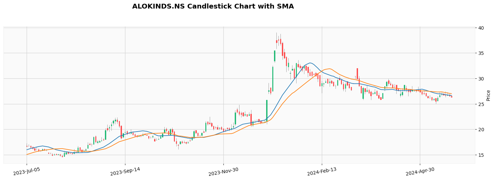
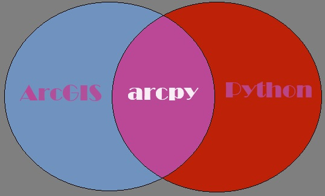

# Geospatial Toolset


Welcome to my repository of geospatial data science projects! This collection houses a variety of my data science and geospatial notebooks and python scripts, which serve as a testament to my proficiency and knowledge in this field. Each project showcases various facets of data analysis, machine learning, and visualization techniques.

```tags```: python, data-science, jupyter-notebook, ipython-notebook, exploratory-analysis, geospatial, machine-learning, deep-learning


# Projects

<table>
  <tbody align="center">
    <tr>
      <td>
        <a href="stock_price_forecasting.ipynb" target="_blank">
          <h4>Stock Price Forecasting</h4>
          
        </a>
        <p>It uses Yahoo Finance stock data to forecast stock prices using ARIMA and SARIMAX model. The EDA analysis and step-by-step implementation of these two models presented in Jupyter Notebook</p>
      </td>
      <td >
        <a href="" target="_blank">
          <h4>ArcGIS Python Scripts Examples</h4>
          
        </a>
        <p>Several Python scripts written using arcpy module for the purpose of learning. It helps us the use of arcpy module. An add-in button example also added to this repositary.</p>
      </td>
    </tr>
  </tbody>
</table>


# geoutils-rsg

Geospatial Utilities for Remote Sensing and GIS Application.

This repository has several scripts written in Python for Remote Sensing and GIS data analysis and workflow automation. This is an early development toolset, and is suitable for geospatial data analysis. Features and implementation are subject to change.

# Introduction

The `geoutils-rsg` Python package aims to simplify geospatial tasks and automate geospatial application development. This library provides a comprehensive set of tools for Remote Sensing and GIS. By addressing the gaps in geospatial data processing tools and offering automation capabilities, this package proves to be an essential resource. Many of the tools are derived from scientific research articles, while others consist of efficient algorithms that enable streamlined processing with minimal code. With these tools, users or researchers can focus on analyzing their application results rather than spending time on coding or starting from scratch.

# Features

### Raster Functionalities

| Functions or Classes                   | Descriptions                                    |
| :------------------------------------- | :---------------------------------------------- |
| clip_raster_by_extent()                | Clip Raster by Extent                           |
| raster_to_point()                      | Convert Rater Pixel to Point Shapefile          |
| dn_to_radiance()                       | Convert Pixel DN Values to Radiance             |
| extract_lulc_class()                   | Export Individual LULC Class                    |
| get_border_pixel_values()              | Extract Border Pixel Values                     |
| group_raster_pixels()                  | Group Homogeneous Pixel Values                  |
| find_sinknflat_dem()                   | Identify Sink/Flat Pixels in DEM                |
| radiance2degree_celsious_temperature() | Convert Radiance to Degree-Celsious Temperature |
| regular_shift_raster()                 | Shift Raster in Different Direction             |
| mosaic_raster()                        | Mosaic GeoTIFF Tiles                            |

### Vector Functionalities

| Functions or Classes           | Descriptions                                       |
| :----------------------------- | :------------------------------------------------- |
| get_cumulative_drainage_area() | Calculate Cumulative Drainage Area                 |
| generate_river_xscl()          | Create Cross-Section Line of River                 |
| generate_grid_boundary()       | Generate Grid Boundary from Point                  |
| get_nearest_point()            | Find Closest Point                                 |
| LineDirectionError()           | Check River Network's Line Direction               |
| GenerateHydroID()              | Generate HydroID of River Network                  |
| CreateGroupID()                | Generate GroupID of River Network                  |
| CreateObjectID()               | Generate ObjectID of River Network                 |
| FnTnodeID()                    | Generate From-Node and To-Node ID of River Network |
| wkt_to_gdf()                   | Convert WKT to Geo-DataFrame                       |
| extract_overlap_polygon()      | Extract Overlap Polygon Geometry                   |
| merge_shapefiles()             | Merge Vector Files                                 |

### Tools for Application

| Functions or Classes               | Descriptions                                                                                   |
| :--------------------------------- | :--------------------------------------------------------------------------------------------- |
| generate_shoreline_raster()        | Shoreline Extraction                                                                           |
| generate_morphometric_parameters() | Morphometric Analysis for Prioritizing Sub-watershed and Management Using Geospatial Technique |
| shoreline_change_analysis() | Digital Shoreline Change-Rate Analysis (example: `notebooks/shoreline_change_rate.ipynb`) |

# Installation

pip install git+https://github.com/dghorai/geoutils-rsg

# Contributing
We welcome contributions! If you wish to contribute to this repository, kindly adhere to the guidelines provided below. We greatly appreciate any enhancements, bug fixes, or additional projects.

- Fork the repository to your GitHub account
- Establish a fresh branch for your modifications or contributions
- Implement your alterations, improvements, or repairs in your branch
- Verify your modifications to guarantee they do not cause any problems
- Record your modifications with a concise and detailed commit message
- Upload/Push your modifications to your forked repository
- Finally, submit a pull request to the main repository

# Reference Data Science Projects
- [Data Science Machine Learning Project with Source Code](https://github.com/durgeshsamariya/Data-Science-Machine-Learning-Project-with-Source-Code)
- [Data Science Projects](https://github.com/SUKHMAN-SINGH-1612/Data-Science-Projects)
- [Data Science Projects](https://github.com/yusufcinarci/Data-Science-Projects)
- [500 AI Machine learning Deep learning Computer vision NLP Projects with code](https://github.com/ashishpatel26/500-AI-Machine-learning-Deep-learning-Computer-vision-NLP-Projects-with-code)

# Other References
- [Free Stock Photos](https://freestocks.org/)
