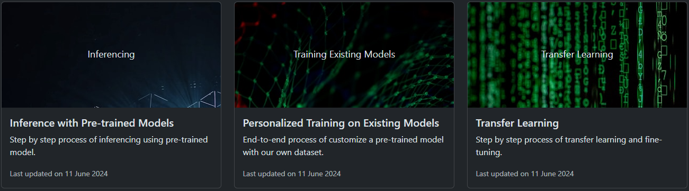

# pygeoml

A comprehensive, step-by-step guide on machine learning algorithms that can be implemented in Python and decode data science for practical applications. It also consisting of research on geospatial and machine learning toolsets and their application.

## Introduction

The Python package `pygeoml` aims to simplify machine learning tasks and automate spatial and non-spatial data science projects. This library is meant to be a resource for learning, growing, and sharing information about data science. This library is a collection of existing models and their applications and has the following features for a comprehensive conceptual understanding of machine learning models: 

1) Inference with pre-trained models
2) Personalized training on existing models
3) Transfer Learning
4) Sample model from scratch
5) ML utility toolkit

## Inference with Pre-trained Models

## Personalized Training on Existing Models

## Transfer Learning

## Sample Model from Scratch

## ML Utility Toolkit

## [Theory, Practical, and Assignments](https://github.com/dghorai/fsds-bootcamp-2.0)
- [Python Basics](https://github.com/dghorai/pygeoml/tree/main/projects/FSDS-BootCamp-2.0/python_basics)
- [Python Advanced](https://github.com/dghorai/pygeoml/tree/main/projects/FSDS-BootCamp-2.0/python_advanced)
- [ML Theory and Assignment](https://github.com/dghorai/pygeoml/tree/main/projects/FSDS-BootCamp-2.0/ml_assignment)
- [ML Practical](https://github.com/dghorai/pygeoml/tree/main/projects/FSDS-BootCamp-2.0/ml_practical)
- DL Theory and Assignment
- [DL Practical](https://github.com/dghorai/pygeoml/tree/main/projects/FSDS-BootCamp-2.0/dl_practical)
- CV Theory and Assignment
- NLP Theory and Assignment
- NLP Practical
- PowerBI Assignment

## [Data Science Projects](https://github.com/dghorai/data-science-projects)
- [AWS CI/CD Deployment](https://github.com/dghorai/pygeoml/tree/main/projects/AWS-CICD-Deployment)
- [CIFAR-100 Classifier](https://github.com/dghorai/pygeoml/tree/main/projects/DL-CIFAR100-Classifier)
- [Flower Recognization](https://github.com/dghorai/pygeoml/tree/main/projects/DL-Flower-Recognization)
- [House Price Prediction](https://github.com/dghorai/pygeoml/tree/main/projects/House-Price-Prediction)
- [Loan Approval Prediction](https://github.com/dghorai/pygeoml/tree/main/projects/Loan-Approval-Prediction)
- [Logistic Regression Project](https://github.com/dghorai/pygeoml/tree/main/projects/Logistic-Regression)
- [Mobile Screen Detection](https://github.com/dghorai/pygeoml/tree/main/projects/Mobile-Screen-Detection)
- [OCR Demo](https://github.com/dghorai/pygeoml/tree/main/projects/OCR)
- [Object Detection](https://github.com/dghorai/pygeoml/tree/main/projects/Object-Detection)
- [Offline Handwritten Text Recognition](https://github.com/dghorai/pygeoml/tree/main/projects/Offline-Handwrrittentext-Recognition)
- [Random Forest Regression](https://github.com/dghorai/pygeoml/tree/main/projects/Random-Forest-Regression)
- [Titanic Survival Prediction](https://github.com/dghorai/pygeoml/tree/main/projects/Titanic-Survival-Prediction)
- [XGBoost Classification Project](https://github.com/dghorai/pygeoml/tree/main/projects/XGBoost-Classification)
- Object Segmentation
- Object Tracking
- [Geospatial Project](https://github.com/dghorai/geoutils-rsg/tree/main)
- Time Series Project
- Generative AI Project
- [Web Scraping Demo](https://github.com/dghorai/pygeoml/tree/main/projects/Web-Scraping)

#### References
- [12 Data Science Projects for Beginners and Experts](https://builtin.com/data-science/data-science-projects)
- [Auto generate README.md file](https://rahuldkjain.github.io/gh-profile-readme-generator/)
- [README.md example](https://github.com/giswqs/giswqs/blob/master/README.md)
- [Get Bootstrap](https://getbootstrap.com/docs/5.3/examples/)
- [Open source photos](https://unsplash.com/s/photos/data-science?license=free)
- [markus-spiske-hvSr_CVecVI-unsplash](https://unsplash.com/photos/computer-coding-screengrab-hvSr_CVecVI)
- [fabio-oyXis2kALVg-unsplash](https://unsplash.com/photos/geometric-shape-digital-wallpaper-oyXis2kALVg)
- [markus-spiske-iar-afB0QQw-unsplash](https://unsplash.com/photos/matrix-movie-still-iar-afB0QQw)
- [pietro-jeng-n6B49lTx7NM-unsplash](https://unsplash.com/photos/green-and-red-light-wallpaper-n6B49lTx7NM)
- [hans-reniers-lQGJCMY5qcM-unsplash](https://unsplash.com/photos/three-clear-beakers-placed-on-tabletop-lQGJCMY5qcM)
- [ML model from scratch](https://www.linkedin.com/pulse/building-machine-learning-model-from-scratch-luis-soares-m-sc-/)
