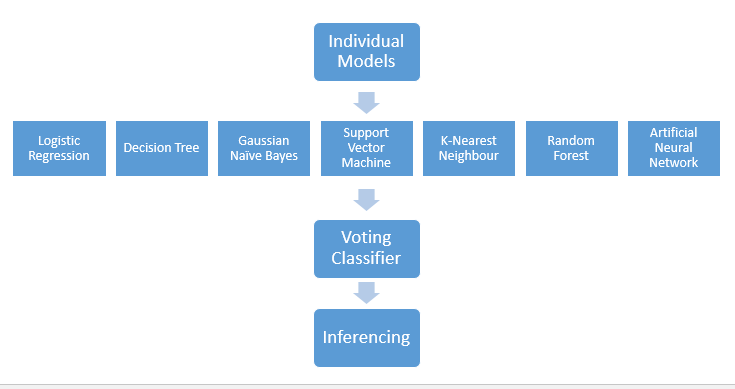

## Machine Learning on Loan Approval Prediction

#### An Ensemble Model to Predict Loan Approval

## About Dataset

The historical records on loan approval status obtained from [kaggle](https://www.kaggle.com/datasets/devzohaib/eligibility-prediction-for-loan). This dataset was a partial datasets provided by Dream Housing Finance Company ([CC0: Public Domain](https://www.kaggle.com/datasets/devzohaib/eligibility-prediction-for-loan)) to automate the loan eligibility process based on customer detail provided while filling online application form. The datasets has several fields/columns namely gender, marital status, education, number of dependents, income, loan amount, credit history, and more.

## Inferencing

## Deployment URL: https://dghorai.pythonanywhere.com/
