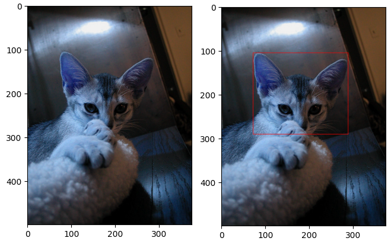

# Object Detection Algorithms and Workflow

An end-to-end workflow of object detection process including pretrained models and object detection algorithms.

#### Algorithms

- ML based approach
  - Neural Network Approach
    - [Region-based Convolutional Neural Networks (R-CNN)](https://github.com/dghorai/data-science-projects/blob/main/object-detection/research/neural-network-approach/rcnn_keras.ipynb)
    - Fast R-CNN
    - Faster R-CNN
    - YOLO (You Only Look Once)
    - SSD (Single Shot MultiBox Detector)
    - [TFOD2 (TensorFlow 2 Object Detection API)](https://github.com/dghorai/data-science-projects/blob/main/object-detection/research/neural-network-approach/tfod2_pretrained.ipynb)
    - [Detectron2 (It is Facebook AI Research's next generation library)](https://github.com/dghorai/data-science-projects/blob/main/object-detection/research/neural-network-approach/detectron2_pretrained.ipynb)
    - Spatial Pyramid Pooling (SPP-net)
    - Region-based Fully Convolutional Network (R-FCN)
    - Sliding Window Approach
  - Non-neural Approach
    - Histogram of Oriented Gradients (HOG) Method
    - SIFT Method
    - Viola-Jones Algorithm
- Non-ML based approach
  - Template Matching


## Annotation



## Getting Started

These instructions will get you a copy of the project up and running on your local machine for development and testing purposes. See deployment for notes on how to deploy the project on a live system.

Learn more at our [documentation](https://github.com/dghorai) and see [projects/](https://github.com/dghorai) for some practical implementation on object detection algorithms.

## Prerequisites

```
python

tensorflow

pytorch

scikit-learn

google colab

```

## Installing

A step by step series of examples that tell you how to get a development env running:

```
pip install -r requirements.txt

```

## Trained Models
```
TFOD2: src/TFOD2/final_model/inference_graph/
Detectron2: src/Detectron2/
```


## Authors

- **Debabrata Ghorai** - _Initial work_ - [@dghorai](https://github.com/dghorai)

See also the list of [contributors](https://github.com/your/project/contributors) who participated in this project.

## License

[MIT](https://choosealicense.com/licenses/mit/)

## Acknowledgements
